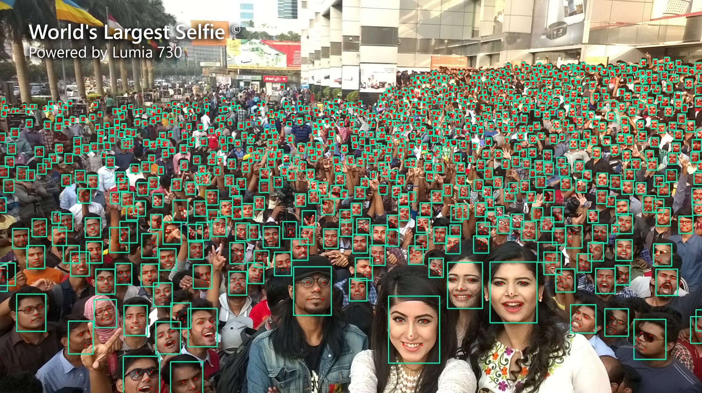
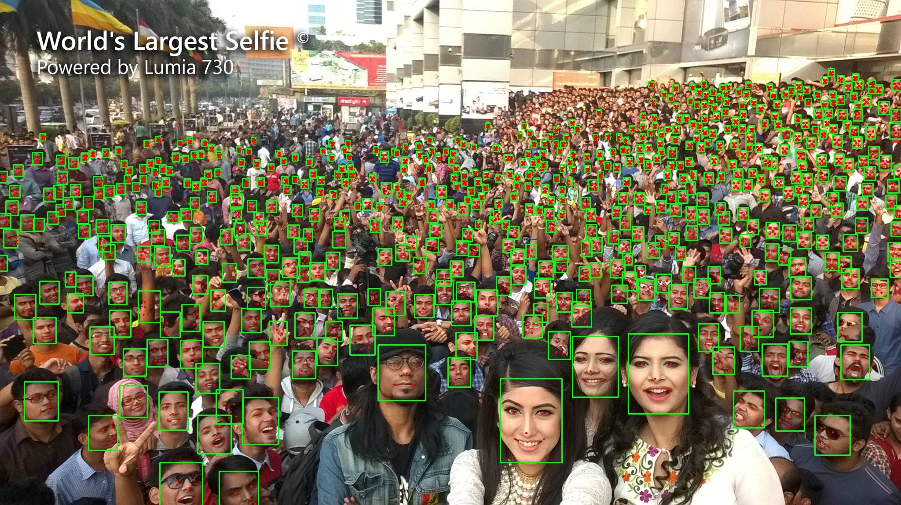
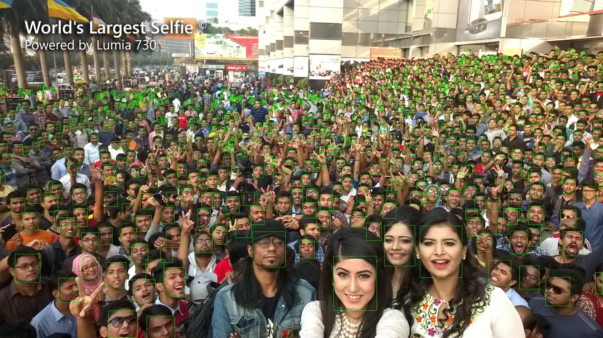

# DBFace
DBFace is a real-time, single-stage detector for face detection, with faster speed and higher accuracy

## MAP@0.5 Result on validation set of WiderFace

*  Single Scale Inference on the Original Image

Method | Version | Size | Easy | Medium | Hard
-|-|-|-|-|-
RetinaFace-MobileNetV2 | Small | 1.68MB  | 0.896 | 0.871 | 0.681
DBFace-MobileNetV3-ReLU (Ours) | Large | 7.03MB | 0.883 | **0.880** | **0.786** 
DBFace-MobileNetV3 (Ours) | Large | 7.03MB | **0.905** | **0.896** | **0.794** 
CenterFace-MobileNetV2 | Large | 7.3MB | ? | ? | ?

## Result on DBFace (threshold = 0.2)

---

## Result on RetinaFace-MobileNetV2 (threshold=0.2)

* [link.retinaface](https://github.com/deepinsight/insightface/tree/master/RetinaFace)

## Result on CenterFace-MobileNetV2 (threshold=?)

* [link.centerface](https://github.com/Star-Clouds/CenterFace)

## MAP@0.5 Result on validation set of WiderFace

## Speed and Train

coming soon...

## Onnx And TensorRT
[tensorRTIntegrate](https://github.com/dlunion/tensorRTIntegrate)

## Author
- [liuanqi-libra7](https://github.com/liuanqi-libra7)
- [dlunion](https://github.com/dlunion)

## References

1. Hamid Rezatofighi1, Generalized Intersection over Union: A Metric and A Loss for Bounding Box Regression：https://arxiv.org/abs/1902.09630

2. Xingyi Zhou, Objects as Points：https://arxiv.org/abs/1904.07850

3. Zili Liu, Training-Time-Friendly Network for Real-Time Object Detection：https://arxiv.org/abs/1909.00700

4. Zhen-Hua Feng, Wing Loss for Robust Facial Landmark Localisation with Convolutional Neural Networks: https://arxiv.org/abs/1711.06753v4

5. Mahyar Najib, SSH: Single Stage Headless Face Detector: https://arxiv.org/abs/1708.03979

6. MobileNet: https://github.com/xiaolai-sqlai/mobilenetv3
